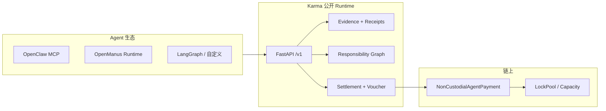
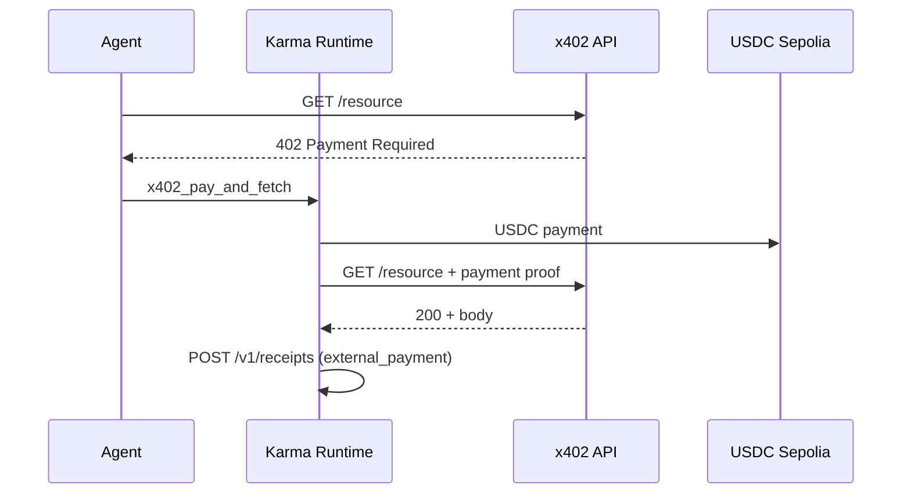
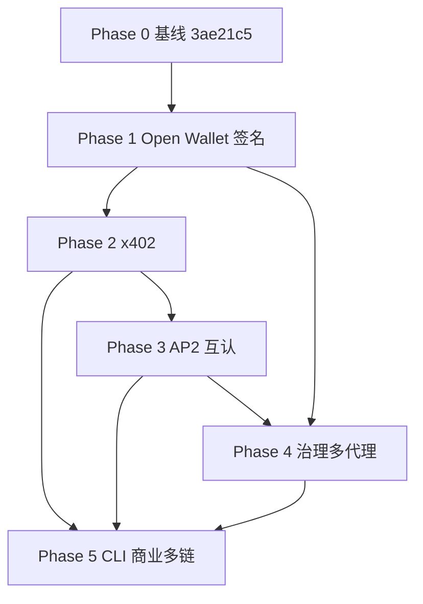

# Karma 生态集成与能力跃迁路线图（分阶段落地）

> **最近更新：** 2026-05-17  
> **公开基线：** `main` @ `3ae21c5`（#78–#83：Phase 1 trade、SDK、生产闸门、压测/MEDIUM 修复）  
> **定位原则：** 与 [`FOCUS_ROADMAP.md`](FOCUS_ROADMAP.md) 一致 —— **Evidence Bundle + 责任图 + 非托管结算** 为差异化核心；Open Wallet / x402 / AP2 为 **适配层与生态入口**，不替代链上结算真源。

---

## 0. 执行摘要

| 维度 | Before（当前基线） | After（目标态） |
|------|-------------------|-----------------|
| 安全/托管 | USDC lock + capacity + voucher；Runtime Key + automation-policy | + 签名后端可插拔（OS/HW/MPC）；策略前检查；任务级限额 |
| 支付/结算 | 证据驱动内部结算 + 部分退款/仲裁 | + x402 对外 API 微支付；AP2 Mandate 与 Evidence 互认；混合审计 |
| 互操作 | OpenClaw MCP + OpenManus RuntimeClient | + Open Wallet 风格工具；标准证据导出；EVM 优先多链预留 |
| 治理 | Responsibility Graph + readiness + KSA2-034 | + policy-as-code；多代理 Mandate 链；私仓动态风控 |
| 采用 | 开源可测 + 生产闸门 | + CLI 一键接入；公开 benchmark；SaaS/企业钩子（私仓） |

**推荐执行顺序：** Phase 1（Open Wallet 签名抽象）→ Phase 2（x402）→ Phase 3（AP2/Evidence 互认）→ Phase 4（治理增强）→ Phase 5（商业与多链）。

---

## 1. 范围与边界

### 1.1 纳入本路线图

- 公开仓：适配器、API 扩展、SDK/MCP/CLI、证据 schema 扩展、验收与 benchmark。
- 私有仓（Karma2）：BillManager 深化、风控评分、子账户/派生账户（若涉及合约）、企业 KYC/fiat 钩子。
- 跨仓：OpenAPI 按需合并、`CORE_VERSION.lock` 锁步、manifest 真地址。

### 1.2 明确不做（或 defer）

- 用 x402/AP2 **替换** 现有 settlement 状态机或 Evidence Bundle 核心字段。
- 在公开仓实现完整 KYA/反作弊模型（保持私仓边界，见 [`AGENT_INTEGRATION.md`](AGENT_INTEGRATION.md)）。
- 首版支持全部链（Solana/Bitcoin 等标为 Phase 5+）。
- 无验收标准的「叙事型」集成（每项必须对应 pytest/集成测/公开摘要）。

### 1.3 决策闸门（每项开工前）

引用 [`FOCUS_ROADMAP.md`](FOCUS_ROADMAP.md) 三问：

1. 是否直接提升 **结算正确性/安全性**？  
2. 是否降低 **agent 集成摩擦**？  
3. 是否能在测试网/主网证明 **真实经济闭环**（ERC20 转移）？

三问均为「否」→ 放入 backlog，不进入当前 Phase。

---

## 2. 当前基线能力清单（Phase 0 — 已完成）

以下能力 **已存在于公开 `main`**，后续阶段只扩展、不重复建设。

| 能力 | 代码/文档锚点 |
|------|----------------|
| Phase 1 贸易/预授权 | `/v1/trade/orders/*`、`/v1/payment-codes`、Console trade、`services/trade_order_pipeline.py` |
| 流水线安全 | 幂等、`chain_anchor_hash`、settlement transition 审计（#79） |
| OpenClaw / OpenManus | `packages/karma-openclaw`、`packages/karma-openmanus`、`docs/PHASE1_CLAW_MANUS_LIVE_ACCEPTANCE-zh.md` |
| 责任与自动化 | `/v1/responsibility`、`agent_automation_policy`、`openclaw_automation_readiness` |
| 证据与收据 | `docs/evidence-bundle-standard.md`、`api/routes/receipts.py`、execution receipt |
| 生产闸门 | `docs/PRODUCTION_PRELAUNCH_CHECKLIST-zh.md`、`scripts/production-prelaunch-gate.sh` |
| 安全回归 | `docs/public-testing/STRESS_ATTACK_ACCEPTANCE_2026-05-17.md`、KSA/KSA2 矩阵 |
| Payment Intent（契约层） | `openapi/karma-v1.yaml` `/v1/payment-intents`（实现可渐进） |

---

## 3. 分阶段路线图总览

| Phase | 名称 | 核心交付 | 主要跃迁维度 | 依赖 |
|-------|------|----------|--------------|------|
| **1** | Open Wallet 签名与策略层 | `SigningBackend`、policy 前检查、文档 | 安全/非托管 | Phase 0 生产闸门 |
| **2** | x402 机器支付 | x402 client/middleware、混合审计字段 | 支付/结算、互操作 | Phase 1 签名、Sepolia USDC |
| **3** | AP2 / Verifiable Intent 互认 | Mandate 映射、PaymentIntent 实现、SD-JWT 导出 | 支付、互操作 | Phase 2、Evidence schema |
| **4** | 治理与多代理控制 | policy-as-code、Mandate 链、自修复 playbook | 治理 | Phase 3、Karma2 风控 |
| **5** | 生产商业与多链 | CLI、benchmark 发布、多链适配器、SaaS 钩子 | 采用、互操作 | Phase 1–4 稳定 |

---

## 4. Phase 1 — Open Wallet 签名与策略层

**目标：** 代理运行时 **不持有明文私钥**；所有链上/高价值动作经 **可插拔签名后端 + 统一策略前检查**。

### 4.1 交付物

| # | 交付 | 路径/模块（建议） | 公私 |
|---|------|-------------------|------|
| 1.1 | `SigningBackend` 协议（async `sign_typed_data` / `get_address`） | `sdk/signing_backend.py` 或 `packages/karma-sdk-core/` | 公开 |
| 1.2 | 实现：`LocalDevBackend`（现有测试）、`EnvKeyBackend`（仅 dev）、`ExternalWalletBackend`（WalletConnect/viem 桥接） | 同上 + `docs/OPEN_WALLET_SIGNING-zh.md` | 公开 |
| 1.3 | 策略前检查：`SpendingPolicy`（allowlist 合约/方法、单笔/日限额、deadline） | 扩展 `services/agent_automation_policy.py` + Console 字段 | 公开 API |
| 1.4 | Runtime 集成：trade launch / voucher accept 路径调用 `SigningBackend` 而非内联 key | `services/trade_order_pipeline.py`、`sdk/client.py` | 公开 |
| 1.5 | MCP 工具：`karma_sign_intent_preview`、`karma_sign_and_submit`（只读预览 + 显式确认） | `packages/karma-openclaw/` | 公开 |
| 1.6 | 配置项 | `deploy/.env.paas.example`：`KARMA_SIGNING_BACKEND=local\|walletconnect\|...` | 公开 |

### 4.2 验收标准

- [x] EIP-712 `TradeLaunchIntent` + `SigningBackend` + signing-preview API（`main` @ `84b9345` / PR #86）
- [x] Voucher 统一：`trade_launch_attestation` + `voucher_buyer_commitment`（Phase 1.5）
- [x] 生产闸门 + KSA-TL 回归（`tests/unit/test_trade_launch_security.py`）
- [ ] Sepolia E2E：钱包签名完成一笔 trade launch（人工；填入 [PHASE1_OPEN_WALLET_ACCEPTANCE.md](public-testing/PHASE1_OPEN_WALLET_ACCEPTANCE.md)）
- [ ] 私有环境 Redis+PG 压测/攻击复跑（可选）

### 4.3 技术风险与缓解

| 风险 | 缓解 |
|------|------|
| WalletConnect 会话劫持 | 短会话 + Console 绑定 agent_id；生产 `OPENCLAW_REQUIRE_SERVER_ATTESTATION` |
| 策略与链上金额不一致 | 签名前拉取 capacity/settlement 快照校验 |

### 4.4 Karma2 同步项

- 更新 `CORE_VERSION.lock`；若仅 SDK/文档无 OpenAPI 破坏性变更，可文档级锁步。
- 私仓 E2E 仍用 KMS/HSM 时实现 `SigningBackend` 私有子类。

---

## 5. Phase 2 — x402 机器支付闭环

**目标：** Karma agent 可调用 **任意 x402 兼容 HTTP API**（402 → 支付 → 重试），并将外部支付锚定到 **内部 Evidence/Receipt 审计链**。

### 5.1 交付物

| # | 交付 | 路径/模块（建议） | 说明 |
|---|------|-------------------|------|
| 2.1 | x402 客户端 | `sdk/x402/client.py`：解析 `402` + `Payment-Required` 头、报价校验 | 参考 Coinbase x402 文档 |
| 2.2 | x402 支付执行 | 复用 Phase 1 `SigningBackend` + USDC `transferWithAuthorization` 或 x402 推荐路径 | Sepolia 优先 |
| 2.3 | HTTP 中间件（可选） | `sdk/x402/middleware.py` 供 FastAPI/Starlette 卖家侧返回 402 | 示例服务 |
| 2.4 | 审计桥接 | `ExecutionReceipt` / receipt API 增加 `external_payment: { protocol: "x402", tx_hash, amount, resource_url }` | OpenAPI additive |
| 2.5 | 混合结算标识 | settlement metadata：`funding_source: internal \| x402 \| hybrid` | 不改变核心状态机 |
| 2.6 | 示例 | `examples/x402_agent_buy_api/`：买一次付费 API 并生成 Evidence | 公开 |
| 2.7 | MCP | `karma_x402_fetch(url, max_budget)` | OpenClaw |

### 5.2 验收标准

- [ ] 集成测试：mock 402 服务 → 支付 → 200 响应，receipt 含 `external_payment`。
- [ ] 测试网可选：真实 x402 provider（小额 USDC）记录在 `docs/public-testing/` 摘要。
- [ ] 攻击回归：超额预算、重复 402、路径遍历 URL → 拦截（扩 `attack-testing-roadmap.md` KSA 行）。
- [ ] Benchmark 脚本（初版）：`scripts/benchmark_x402_evidence_integrity.py` 输出 JSON 摘要。

### 5.3 架构示意

### 5.4 与现有 Payment Code 关系

- **内部任务结算**：继续 `payment-codes` + settlement 状态机。  
- **外部 API 消费**：走 x402，收据挂到 **同一 `task_id`**，便于责任图与争议统一查询。

---

## 6. Phase 3 — AP2 / Verifiable Intent 与证据互认

**目标：** Karma Evidence Bundle 与 **AP2 Mandate / Verifiable Intent** 双向映射；`PaymentIntent` API 从 OpenAPI **落地实现**。

### 6.1 交付物

| # | 交付 | 路径/模块（建议） |
|---|------|-------------------|
| 3.1 | `docs/AP2_EVIDENCE_PROFILE-zh.md`：字段映射表（Intent/Cart/Payment Mandate ↔ EvidenceBundle） |
| 3.2 | 转换器 | `trusted_agent_runtime/ap2_adapter.py`：`to_ap2_mandate(bundle)` / `from_ap2_mandate(...)` |
| 3.3 | SD-JWT 导出（可选） | `services/evidence_export.py`：公开可验证摘要，不含私仓评分 |
| 3.4 | Payment Intent API | 实现 `POST/GET /v1/payment-intents`（对齐现有 OpenAPI schema） |
| 3.5 | Human-Not-Present 模式 | automation-policy 增加 `human_not_present_allowed` + 更严默认限额 |
| 3.6 | 验证端点 | `POST /v1/evidence/{id}/verify-external`：校验 AP2 签名与 digest 一致性 |

### 6.2 验收标准

- [ ] 单测：sample bundle ↔ AP2 JSON 往返不丢必填字段（`evidence_hash` 稳定）。
- [ ] 集成：创建 PaymentIntent → 绑定 voucher/task → settlement 完成 → intent `SETTLED`。
- [ ] 第三方只读验证：仅凭 SD-JWT/导出 JSON 可复算 digest（文档给出命令）。
- [ ] 更新 [`API_ROADMAP_V01.md`](API_ROADMAP_V01.md) M5 状态为「已实现 /v1 子集」。

### 6.3 私有仓职责

- 争议权重、反作弊对 AP2 Intent 的 **风险分** 仍在 Karma2 `/v1/verify` 扩展，不进入公开 schema。

---

## 7. Phase 4 — 治理、多代理与自修复

**目标：** 长时、多子代理任务可在 **policy-as-code** 与 **Mandate 链** 下执行；失败可自动 partial refund + 审计。

### 7.1 交付物

| # | 交付 | 说明 |
|---|------|------|
| 4.1 | Policy-as-code v1 | YAML/JSON：`allowed_contracts`、`max_gas`、`max_usdc_per_day`、`abi_selectors` |
| 4.2 | 策略引擎 | `services/policy_engine.py`：在 lock/settle/x402_pay 前评估 |
| 4.3 | 多代理 Mandate 链 | `ResponsibilityEdge` 扩展 `parent_mandate_id`、`child_agent_id` |
| 4.4 | 自修复 playbook | 文档 + 代码钩子：失败 → 自动 `dispute` 或 `partial_settlement` + 通知 OpenClaw webhook |
| 4.5 | Reputation 接口（公开只读） | `GET /v1/agents/{id}/public-reputation`：链上计数聚合，无私仓模型 |

### 7.2 验收标准

- [ ] E2E：三代理链 A→B→C 任务，子代理越权调用被拒。
- [ ] 自修复：模拟执行失败 → 自动 partial refund，Evidence 含 `remediation_action`。
- [ ] 与 KSA2-034 环检测无冲突（扩 `test_triangle_settlement_cycle.py`）。

---

## 8. Phase 5 — 生产商业、CLI 与多链

**目标：** 降低集成门槛；发布可对外引用的 benchmark；多链以适配器扩展。

### 8.1 交付物

| # | 交付 | 说明 |
|---|------|------|
| 5.1 | `karma` CLI | `karma init`、`karma doctor`、`karma run acceptance`（包装现有脚本） |
| 5.2 | Benchmark 套件 | `docs/public-testing/BENCHMARK_AGENT_COMMERCE.md`：Karma+x402 vs 纯支付 agent |
| 5.3 | 多链 `ChainAdapter` | EVM 默认；Solana/BTC stub + 特性开关 |
| 5.4 | SaaS 钩子（公开） | `tenant_id`、分域 API key（若尚未完整实现） |
| 5.5 | 企业能力（私有） | 轻 KYC、fiat on-ramp 文档在 Karma2 `commercial/` |

### 8.2 验收标准

- [ ] 新开发者 30 分钟内跑通 CLI + 示例 x402 + 一笔 testnet settlement（文档计时研究，非日历承诺）。
- [ ] Benchmark 结果入 `docs/public-testing/README.md` 索引。
- [ ] `run_public_acceptance_tests.sh` 全绿 + Forge 全绿。

---

## 9. 横切要求（每个 Phase 必须满足）

### 9.1 测试与 CI

| 类型 | 要求 |
|------|------|
| 单元/集成 | 新增代码必须有 pytest；攻击面更新 [`attack-testing-roadmap.md`](public-testing/attack-testing-roadmap.md) |
| 公开验收门 | `bash scripts/run_public_acceptance_tests.sh` |
| 生产门 | `scripts/production-prelaunch-gate.sh`（`APP_ENV=production` 配置下） |
| 压测 | 新写路径在 **Redis + PostgreSQL** 环境复跑压力脚本 |

### 9.2 文档与版本

- 每 Phase 合并后：更新 [`CHANGELOG.md`](../CHANGELOG.md) + `docs/public-testing/` 一行摘要（若可公开）。
- OpenAPI：**仅 additive** 变更进 `/v1`；破坏性变更走 `/v2` 策略（见 [`API_ROADMAP_V01.md`](API_ROADMAP_V01.md)）。
- Karma2：每 **contract-affecting** 合并跑 `prepare-karma2-sync-package.sh`（见 [`PRIVATE_REPO_EXECUTION_CHECKLIST-zh.md`](PRIVATE_REPO_EXECUTION_CHECKLIST-zh.md)）。

### 9.3 公私仓分工（重复强调）

| 层 | 公开仓 | 私有仓 Karma2 |
|----|--------|---------------|
| 协议与证据 schema | ✅ | 消费 + 扩展 verify |
| x402/AP2 适配器 | ✅ | 可选 fork |
| 评分/反作弊/争议权重 | ❌ | ✅ |
| BillManager 商业逻辑 | 接口/ABI 快照 | ✅ 源码 |
| 企业 KYC/fiat | 钩子文档 | ✅ 实现 |

---

## 10. 里程碑与依赖图

**可并行工作包（资源允许时）：**

- Phase 1 文档 + Phase 2 x402 客户端原型（只读 402 解析）可并行。
- Phase 3 AP2 映射文档可在 Phase 2 开发中期启动。
- Phase 5 CLI 可在 Phase 2 后持续薄迭代。

---

## 11. 首期执行 backlog（Phase 1 拆任务）

以下任务可直接进 GitHub Issues / 私仓 sprint：

| 序号 | 任务 | 估复杂度的技术说明 |
|------|------|-------------------|
| 1.1 | 定义 `SigningBackend` ABC + `LocalDevBackend` | 小：纯 SDK，无链依赖 |
| 1.2 | `deploy/.env` + settings 注册 backend 类型 | 小 |
| 1.3 | trade launch 改用 backend 签名 | 中：触达 pipeline + 测试 |
| 1.4 | 编写 `docs/OPEN_WALLET_SIGNING-zh.md` | 小 |
| 1.5 | OpenClaw MCP 两个签名工具 | 中 |
| 1.6 | Sepolia 手动 E2E + 记入 `public-testing` | 小 |

**Phase 2 预备（可与 1.6 并行调研）：**

| 序号 | 任务 |
|------|------|
| 2.0 | 研读 x402 规范 + 选 1 个公开 test provider |
| 2.1 | `sdk/x402/client.py` 单测（mock 402） |
| 2.2 | receipt `external_payment` OpenAPI PR |

---

## 12. 成功指标（可度量，非日历）

| 指标 | Phase 2 目标 | Phase 5 目标 |
|------|-------------|-------------|
| 外部 x402 支付成功并入 receipt | ≥1 条测试网 tx 可复现 | 文档化 benchmark N≥10 |
| 签名后端类型 | ≥2 种（dev + wallet） | + MPC stub 或 HW |
| 证据第三方验证 | AP2 映射单测 100% 必填字段 | SD-JWT 公开验证命令 |
| 安全回归 | 0 CRITICAL/HIGH 新增 | 保持 + 扩攻击矩阵行 |
| 公开验收测试 | 283+ 通过 | 持续通过 + 新套件 |

---

## 13. 相关文档索引

| 文档 | 用途 |
|------|------|
| [`FOCUS_ROADMAP.md`](FOCUS_ROADMAP.md) | 叙事与 scope 闸门 |
| [`API_ROADMAP_V01.md`](API_ROADMAP_V01.md) | PaymentIntent / Evidence API |
| [`evidence-bundle-standard.md`](evidence-bundle-standard.md) | 证据核心 schema |
| [`M4_ROADMAP_V01.md`](M4_ROADMAP_V01.md) | 证据 schema CI 兼容 |
| [`PHASE1_CLAW_MANUS_LIVE_ACCEPTANCE-zh.md`](PHASE1_CLAW_MANUS_LIVE_ACCEPTANCE-zh.md) | 当前 agent 验收 |
| [`PRODUCTION_PRELAUNCH_CHECKLIST-zh.md`](PRODUCTION_PRELAUNCH_CHECKLIST-zh.md) | 生产配置 |
| [`PRIVATE_REPO_EXECUTION_CHECKLIST-zh.md`](PRIVATE_REPO_EXECUTION_CHECKLIST-zh.md) | Karma2 锁步 |
| [`learnings/launch-checklist.md`](../learnings/launch-checklist.md) | 历史 x402 运营备忘 |

---

## 14. 维护

- 每完成一个 Phase：在本文件顶部更新「最近更新」与 Phase 验收 checkbox。
- 重大方向变更需同步 [`FOCUS_ROADMAP.md`](FOCUS_ROADMAP.md) 的 V2 段或开 ADR（建议 `docs/adr/NNN-x402-integration.md`）。

---

*本路线图描述「可逐步实现」的工程路径；具体 PR 以 OpenAPI additive 变更与公开验收门通过为合并条件。*
