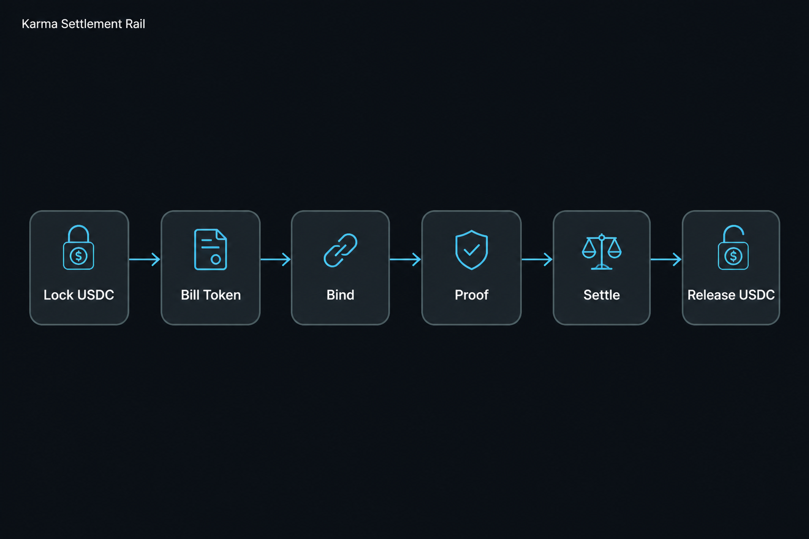
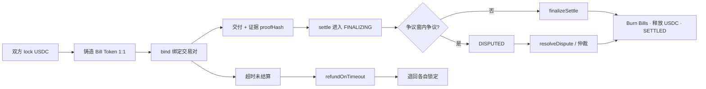

# 02 · 产品核心循环

## 30 秒演示脚本（背诵）

> 买卖双方各自把 USDC 锁进合约，铸出 Bill Token。  
> Bind 把两张 Bill 冻成一笔交易。  
> 交付产生 proofHash，Settle 打开争议窗；  
> 无人争议则 Finalize，烧掉 Bill，USDC 各归其主。  
> **数学结算，而不是人拍板。**

## 核心循环图

## 参与角色

| 角色 | 链上动作 | 链下动作 |
|------|----------|----------|
| Buyer | lock / bind / dispute / finalize | 签 EIP-712、验收、确认 |
| Agent / Seller | lock / 提交交付证据 | Runtime Key、receipt、webhook |
| Admin / 未来治理 | resolveDispute、参数、pause | 运营 Console |
| Verifier（可选） | Attestation / challenge | 去中心化验证节点 |

## 为什么是「Bill Token」而不是「协议币」

- Bill = **锁定 USDC 的会计凭证**（MINTED → BOUND → BURNED）  
- 不变量：`totalBillSupply == totalLocked`  
- 与生态侧可选的协议代币（karma-economy）**刻意隔离**：结算主叙事不依赖发币

## 与链下 API 的对应

| 链上 | 典型链下 API |
|------|----------------|
| lock | `POST /v1/capacity/...` 锁仓额度 |
| 授权 / 意向 | vouchers / payment-codes / trade + EIP-712 |
| 交付 | receipts / bundles / evidence |
| 结算状态机 | `/v1/settlement/{task_id}` |
| 声誉 | settlement-reputation P8 |

完整 Pilot 路径见：`docs/PILOT_E2E_PATH.md`。
