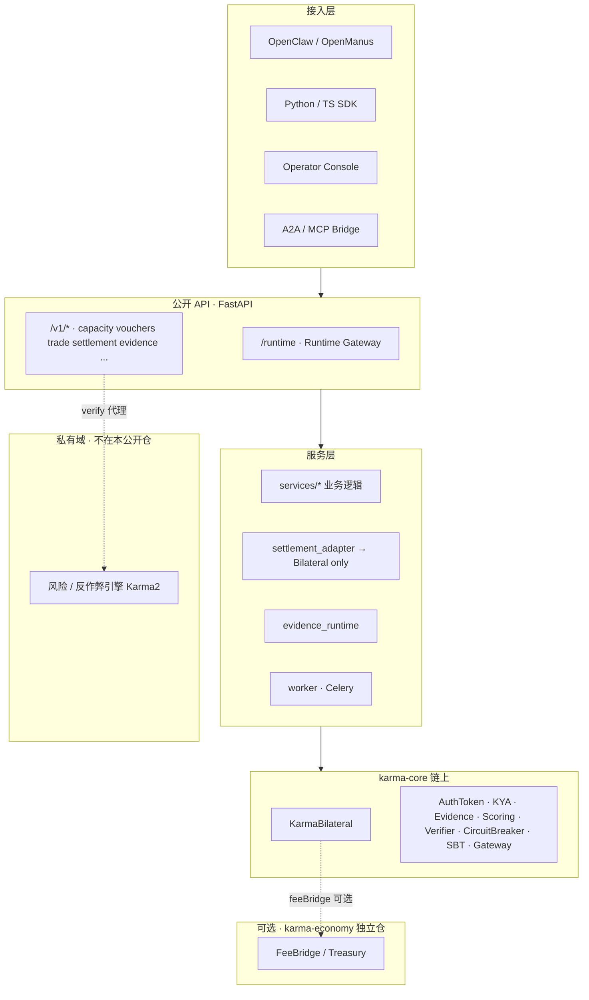
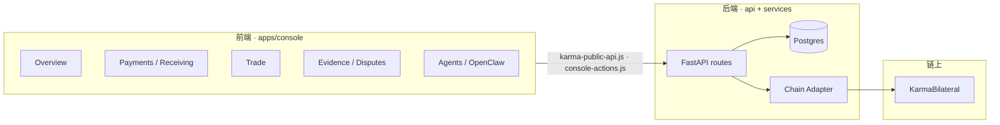
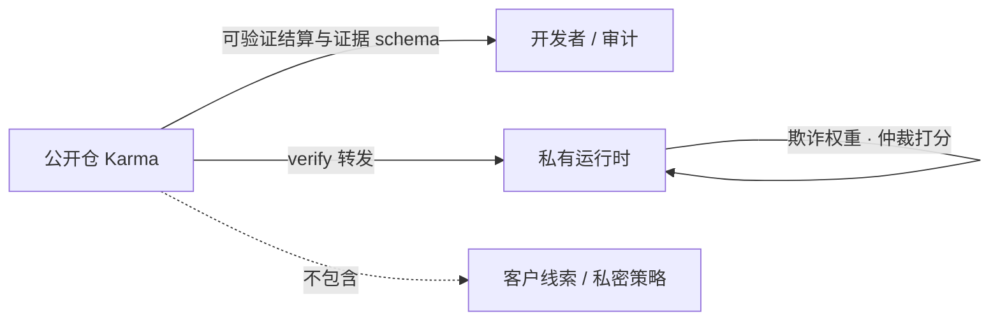

# 03 · 系统工程图

## 分层总览

## 仓库模块地图（投资人可扫一眼）

| 模块 | 路径 | 作用 |
|------|------|------|
| 链上协议 | `karma-core/contracts/` | Bilateral + 配套合约 |
| HTTP API | `api/` | 公开商业接口 |
| 业务逻辑 | `services/` | 结算适配、交易、x402… |
| 证据运行时 | `evidence_runtime/` | Receipt / Bundle / AP2 |
| Console | `apps/console/` | 运营台（静态 HTML/JS） |
| BFF | `apps/karma_bff/` | 编排器 HMAC 集成 |
| SDK | `sdk/` · `packages/sdk` · `packages/karma-sdk` | HTTP + 链上客户端 |
| Agent 桥 | `packages/karma-openclaw` 等 | 生态接入 |
| 验证节点 | `decentralized_verifier/` | Attestation / challenge |
| 部署 | `deploy/` · `docker/` | Sepolia / Compose |

## 前后端实现关系

### 前端实现程度（摘要）

| 页面 | 实现程度 |
|------|----------|
| Overview / Receiving / Payments / Trade | ✅ 对真实 API 实写（last-mile） |
| Evidence / Disputes / Agents / Settings | ✅ 已接线 |
| OpenClaw Connect / Cyber Console | ✅ |
| Dashboard / Verifier Explorer | ⚠️ 可 live，断线时有 mock 回退 |
| Console 内 MetaMask EIP-712 | ❌ 明确 follow-up（签名常由操作者粘贴） |
| BFF 浏览器写操作 | ❌ 只读面板 |

### 后端实现程度（摘要）

| 域 | 路由前缀 | 状态 |
|----|----------|------|
| 结算 / 容量 / 凭证 | `/v1/settlement` `/v1/capacity` `/v1/vouchers` | ✅ |
| 交易 / 支付码 / x402 / Intent | `/v1/trade` `/v1/payment-codes` `/v1/x402` `/v1/payment-intents` | ✅ |
| 证据 / 收据 / Bundle / Verify | `/v1/evidence` `/receipts` `/bundles` `/verify` | ✅ |
| Agent P1–P8 标准面 | agents / confirmations / delivery / reputation… | ✅ |
| OpenClaw / Discovery / Orchestration | `/v1/openclaw` `/discovery` `/orchestration` | ✅ |
| 安全与 Admin | `/v1/security` `/v1/admin` | ✅ |
| Verify → 私有引擎 | 代理边界 | ✅ 公开仓不含引擎权重 |

## 安全边界（必须对投资人讲清）

详见：`docs/security-boundary.md` · `VISIBILITY_MAP.md`
