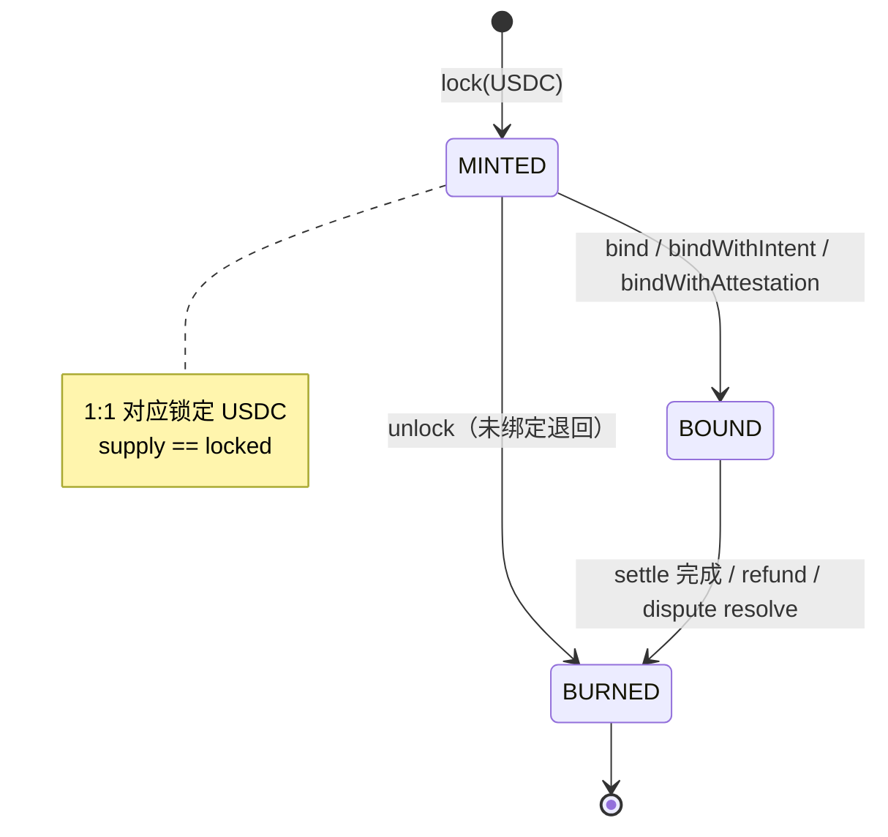
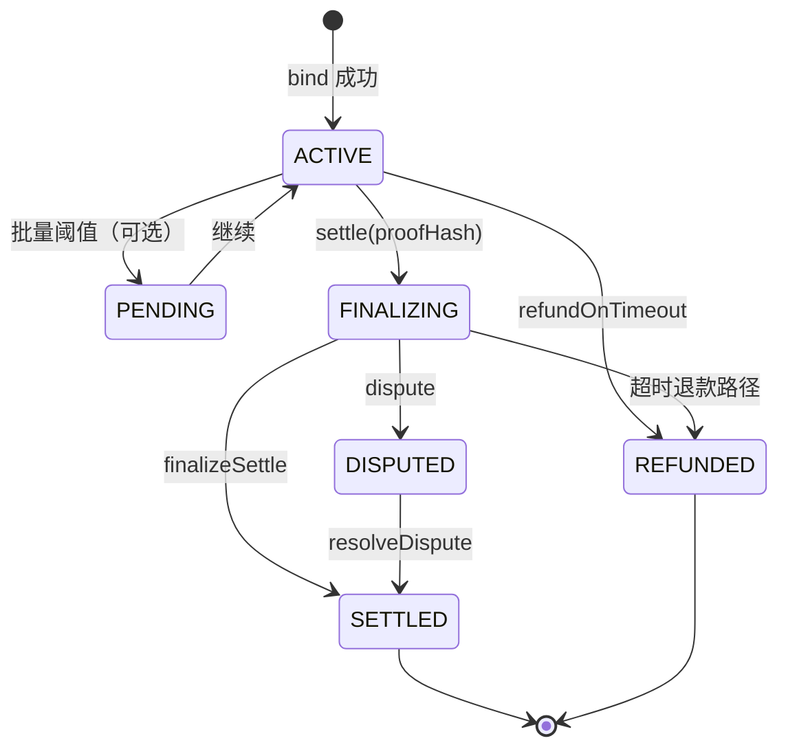
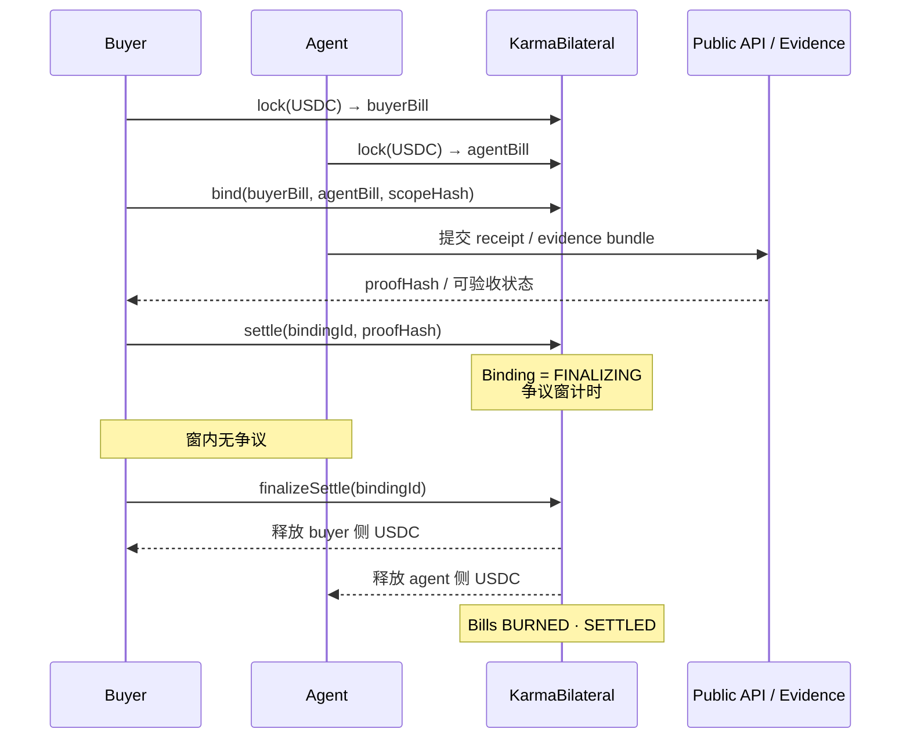
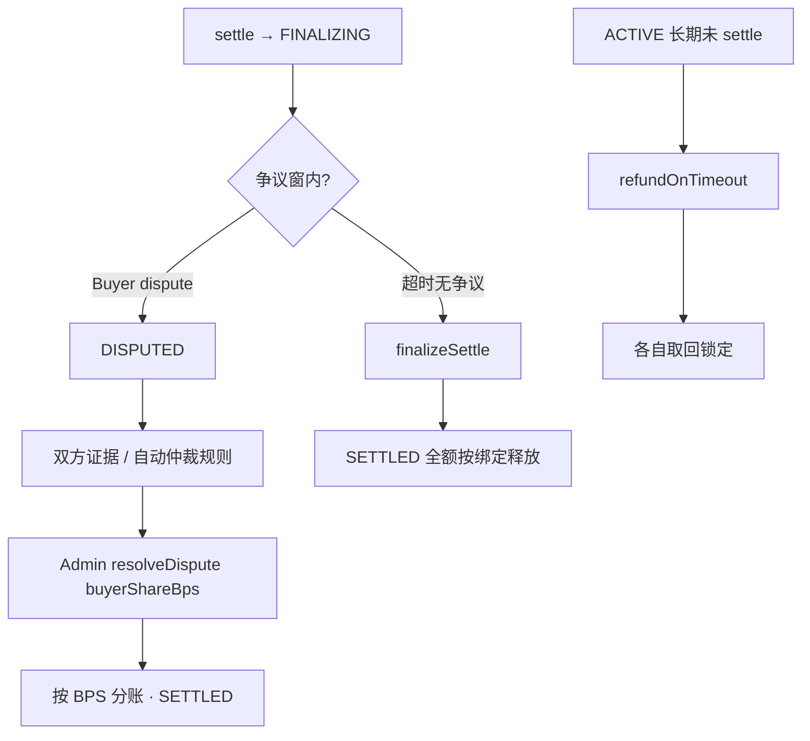

# 04 · 状态机与流程图

> 权威实现：`karma-core/contracts/core/KarmaBilateral.sol`  
> 公开说明：`docs/SETTLEMENT_FLOW_PUBLIC.md` · `docs/DISPUTE_FLOW_PUBLIC.md`

---

## 1) Bill Token 状态机

---

## 2) Binding 状态机

---

## 3) 乐观结算主路径（Happy Path）

---

## 4) 争议与裁决流

---

## 5) 证明层级（已实现 vs 预留）

| 层级 | 方法 | 状态 |
|------|------|------|
| L1 乐观 + 争议窗 | `settle` / `finalizeSettle` | ✅ 已实现 |
| Attestation 网关路径 | `settleWithAttestation` 等 | ✅ 测试覆盖 |
| L2 TEE | `settleWithTEE` | ❌ stub → revert |
| L3 ZK | `settleWithZKProof` | ❌ stub → revert |

---

## 6) 链下 Settlement FSM（API）

公开 API `/v1/settlement` 维护任务级状态（与链上 Binding 协同，经 `settlement_adapter` 对齐 Bilateral）。  
验收与交付标准见 P4–P8 文档（人类确认、重要字段、履约接受、交付核验、结算声誉）。
