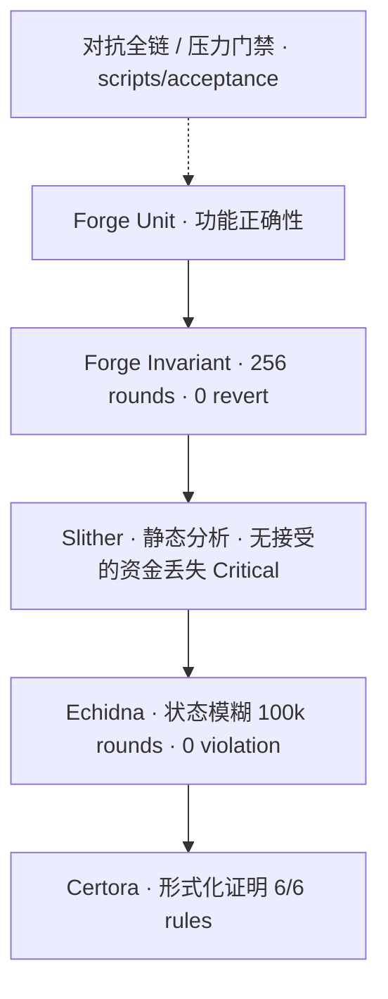

# 06 · 验证与信任层

## 为什么天使轮要看这一页

结算协议卖的是**资金安全信任**。没有验证金字塔，叙事容易变成「又一个 Agent 中间件」。

## 验证金字塔

公开基线见根目录 [`SECURITY.md`](../../SECURITY.md)。

## 信任主张（可核实）

| 主张 | 机制 |
|------|------|
| 非托管 | USDC 锁在 Bilateral；Bill 1:1；无平台挪用叙事 |
| 会计守恒 | `supply == locked`；不变量测试 |
| 意图防重放 | EIP-712 + nonce/digest |
| 争议可预期 | 固定争议窗 + 状态机 |
| 紧急刹车 | CircuitBreaker |
| 公开可审计 | 协议与公开 API 在本仓；高敏打分在私有仓 |

## 发布 / 测试门禁（工程成熟度信号）

| 门禁 | 路径 |
|------|------|
| 公开验收 | `scripts/run_public_acceptance_tests.sh` |
| 全链审计门 | `scripts/acceptance/full_chain_audit_gate.sh` |
| 对抗整仓 | `scripts/acceptance/adversarial_whole_project_suite.py` |
| Console last-mile | `scripts/acceptance/console_last_mile_gate.sh` |
| Phase1/2/3 | Open Wallet / x402 / AP2 gates |
| 安全发布门 | `docs/SECURITY_RELEASE_GATES.md` |

文档化对抗审计：`docs/ADVERSARIAL_FULLCHAIN_AUDIT_V1.md`

## 诚实缺口（主动说，加分）

| 缺口 | 现状 |
|------|------|
| 正式付费 Bug Bounty | 尚未设立（`SECURITY.md`） |
| Mainnet 等价运维 | 受控测试网姿态 |
| Certora 覆盖范围 | 有规则通过；Bilateral 全覆盖仍可加强（见 certora README 提示） |

**建议话术**：我们把钱路径做成可证明的状态机，并公开验证基线；天使资金的一部分用于主网硬化、赏金与外部审计，而不是先堆功能。
