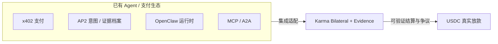

# 07 · 生态集成与测试网

## 定位：补齐「Proof 列」，而不是取代生态

详见：`docs/INTEGRATIONS.md`

## 已落地集成（在仓）

| 集成 | 投资人可看什么 |
|------|----------------|
| **Open Wallet / EIP-712** | `docs/OPEN_WALLET_SIGNING-zh.md` · trade 路径 |
| **x402** | `docs/X402_INTEGRATION-zh.md` · `/v1/x402` · `examples/x402_agent_buy_api/` |
| **AP2** | `docs/AP2_EVIDENCE_PROFILE-zh.md` · export-ap2 · Phase3 验收 |
| **OpenClaw** | `packages/karma-openclaw` · `docs/OPENCLAW_P1_DUAL_AGENT.md` |
| **OpenManus** | `packages/karma-openmanus` · BFF 文档 |
| **MCP / A2A** | `packages/karma-mcp` · `karma-a2a-bridge` |

## Sepolia 测试网（可出示）

| 项 | 值 |
|----|-----|
| 网络 | Sepolia · chainId `11155111` |
| KarmaBilateral | `0x496d178a5D32E9410E52bD5800602BDEe81B2A91` |
| 测试 settle delay | 60s |
| 测试 dispute window | 120s |
| 部署清单 | `deploy/sepolia_bilateral_deployment.json` |

运维脚本：`scripts/testnet/testnet_{lock,release,finalize,refund,dispute,full_flow}.py`

## 公测姿态（对投资人要诚实）

`docs/public-testing/PUBLIC_TESTNET_GO_LIVE-zh.md`：

- ✅ 受控邀请 / 有文档的公开测试网  
- ❌ **不是** Mainnet 等价生产  
- 仍可能待补：部分实时钱包门禁、生产密钥与值守配置（运维清单）

## 现场 Demo 推荐顺序（15 分钟）

1. 打开 Console Overview → 显示 API 健康  
2. Capacity lock（或脚本）→ 展示 Bill  
3. Bind → Settle → 等争议窗 → Finalize（Sepolia）  
4. 展示一条 Evidence Bundle / AP2 export  
5. （可选）OpenClaw 双 Agent 或 x402 一跳支付示例  

剧本：`docs/PILOT_E2E_PATH.md` · `docs/AGENT_TO_AGENT_TEST.md`
