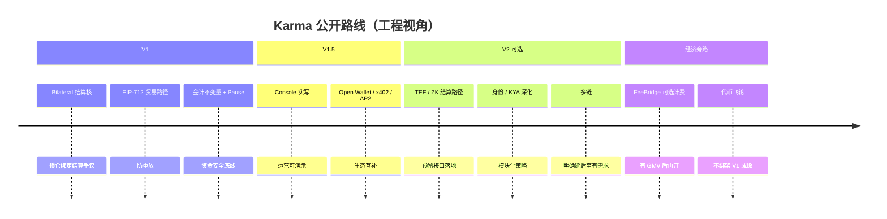

# 08 · 路线图与资金用途叙事

> 产品范围以 `docs/FOCUS_ROADMAP.md` 为准。金额与股权请只写在 [`99-融资条款模板-私下填写.md`](./99-融资条款模板-私下填写.md)。

## 版本叙事（对天使）

## 天使轮「买」什么进度（叙事框架）

用资金换**可验证里程碑**，建议对投资人承诺类别如下（具体数字私下定）：

| 里程碑类别 | 含义 | 与仓库的对应 |
|------------|------|--------------|
| **主网硬化** | 外部审计 + 赏金 + 运维值守 | SECURITY 门禁升级 |
| **真实 Pilot GMV** | 邀请制商家 / Agent 真实 USDC 小额成交 | Pilot E2E 运营化 |
| **接入密度** | 1–2 个头部 Agent 运行时深度集成 | OpenClaw 等已有底座 |
| **产品缺口关闭** | Console 钱包签名、P7 扩展等 | 能力矩阵 ❌→✅ |
| **可选：经济层** | 仅在有稳定 GMV 后开 revenueMode | 与 karma-economy 解耦 |

## 刻意不拿天使钱先砸的方向

1. 全面多链扩张（Solana 等 hollow 包）  
2. 未有成交前的复杂代币激励  
3. 替换掉 x402/AP2/OpenClaw —— 应嵌入而非开战  

## KPI 建议（早期，可公开讨论口径）

| 指标 | 为什么重要 |
|------|------------|
| Sepolia / 主网成功结算笔数 | 证明状态机在真实环境工作 |
| 集成方数量（运行时 / Seller Agent） | 网络效应入口 |
| 争议率与争议解决时长 | 信任产品是否可用 |
| 端到端接入时间（文档→第一笔 settle） | 开发者体验 |
| 验证回归（forge/对抗门禁持续绿） | 不因赶功能牺牲资金安全 |

> 白皮书中的调研比例、发币时间表属于早期草稿意向；**路演时以本图集「已实现矩阵」为准**，避免过度承诺。

## 竞争与护城河（简版）

1. **双边锁定 + Bill 守恒** —— 比纯支付多一层可争议托管  
2. **证据标准接入生态** —— 不另起炉灶打支付协议  
3. **公开可审计结算核 + 私有风控边界** —— 既可信任又可迭代反作弊  
4. **工程验证深度** —— 对天使阶段是稀缺信号
